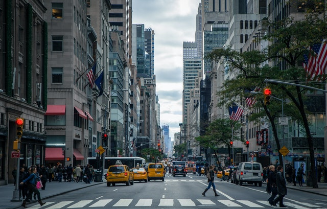
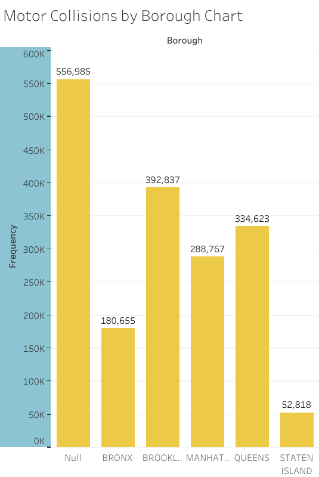
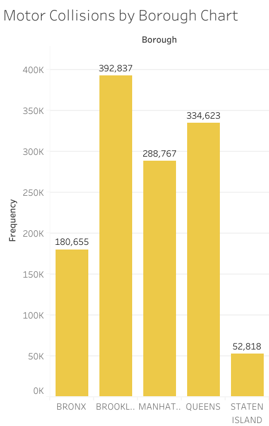

# Motor-Collisions-in-NYC
Case Study 1: Exploring the correlation between motor collisions and weather in NYC

<p align="center">
  
  <p align="center">Photo credit to <a href="https://www.pexels.com/photo/city-street-photo-378570/">Nout Gons</a></p>
</p>

## Introduction 🚗
The NYSDOT is the transportation entity of New York whose main objective is to improve transportation and traffic in the state of New York. With New York City being the most populous city in the state, there is increased interest in improving traffic and preventing motor collisions in its area.  This case study, titled 'Motor Collisions in NYC' explores the connection between Motor Collisions and boroughs of New York City. 

**Business Task** \
1️⃣. Focus on motor collisions in NYC \
2️⃣. Analyze motor collision data for key insights including location, contributing factors, and averages. \
3️⃣. Provide a recommendation for how to reduce motor collisions in high-risk areas.


**Questions for Analysis** 
- Is there a relationship between motor collisions and borough? 
- What can be done to reduce motor collisions in the future? 

**Key Stakeholders** \
Key stakeholders in this analysis would include the *New York State Department of Transportation (NYSDOT)* and the *New York Police Department(NYPD)*. 👥

**Data Source**\
The [NYPD Motor Vehicle Collision](https://data.cityofnewyork.us/Public-Safety/Motor-Vehicle-Collisions-Crashes/h9gi-nx95) dataset includes details of Motor Vehicle Collisions in New York City provided by the Police Department (NYPD) from 2012 to the present. This dataset is updated daily. It includes information such as borough, zip_code, contributing factors, and injured/fatality statistics.

This dataset **ROCCC**s, meaning that it is *Reliable*, *Original*, *Comprehensive*, *Current*, and *Cited*.

## The Data Analysis Process

### 📚 Preparation of the Data 

To begin with preparation, the dataset ['Motor Vehicle Collisions - Crashes'](https://data.cityofnewyork.us/Public-Safety/Motor-Vehicle-Collisions-Crashes/h9gi-nx95) was opened from Google's BigQuery public databases for cleaning and analysis. 

**Files used included the following:** \
-Motor_Vehicle_Collision_-_Crashes.csv

### 📈 Processing of the Data 
Data was cleaned using SQL (bigquery) using the following steps: 
1. Checked for duplicates using the count(distinct(unique_key)) functions. No duplicates were found.
2. Filtered and Sorted Data 

### 📊 Analysis of the Data
To talk about analysis, I split the analytical questions down into **actionable tasks**. These tasks are outlined below as well the analytical work I performed.  

- *Is there a relationship between motor collisions and borough?* 
 1. Create a query to calculate the frequency of each borough to determine number of motor collisions in each area. 
 ````
SELECT 
borough, count(*)
FROM `bigquery-public-data.new_york_mv_collisions.nypd_mv_collisions`
GROUP BY borough
ORDER BY count(*) DESC
 ````
This query generated the following results: 
 

These results are shown visually with the following data visualization using Tableau.

 
 
As you can see above, the frequency chart above produces a table where each borough is ranked by the frequency of motor collisions present. As abundantly clear, the vast majority of motor collisions are not reported to a borough; this is shown by the frequencies found in the null category. 

However, given that the null category is excluded from results, rankings of boroughs are shown as follows: 



Occurrence of Motor Collisions occur in descending order starting with Brooklyn, Queens, Manhattan, Bronx, and then Staten Island.

### ✳️ Recommendations for how to reduce motor collisions in high-risk areas

My recommendations are to prioritize community resources and officers for the Brooklyn, Queens, and Manhattan boroughs because they have the most motor collisions. By having community engagement events, general education (such as reminders to buckle up and reduce distractions while on the road) and an increase in officers in these areas, the amount of motor collisions would likely fall.

### 🚩 Follow-Up Questions 

1. Is there a correlation between motor collisions and street infrastructure?
2. What are the populations of each borough? And does this impact the amount of motor collisions?
3. Is there a correlation between zip code and motor collisions? Is there a correlation between month and motor collisions?
